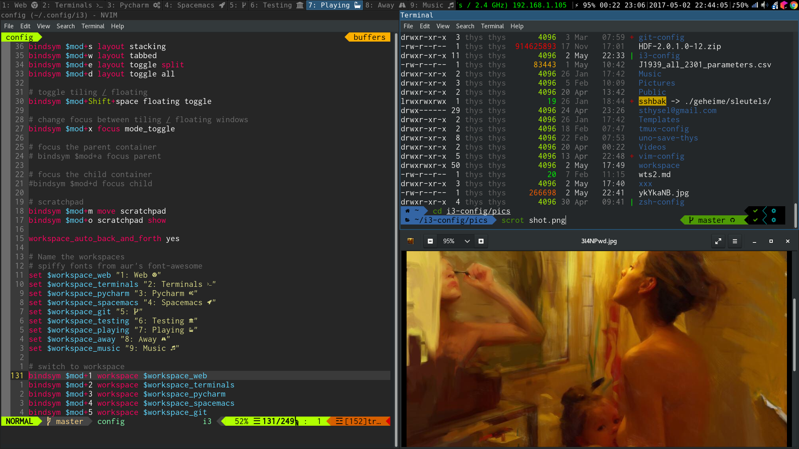

# i3 config



This repo contains several i3 Window manager configs.

They are stored in link-farm fashion so stow can link them into ${HOME}
like so

```
├── piekanien/
│   └── dot/
│       └── .config/
│           └── i3/
│               ├── config
│               └── status

```


## stow install

Choose to install i3 config for piekanien, drop into piekanien and do:

```
$ stow -t ${HOME} dot
```


## Manual install

Clone repo in ~ and depending on the machine the appropiate set is linked in `~/.config/i3` 
like so:

```
  ~/.config/i3 $ tree
.
├── config -> /home/thys/i3-config/piekanien/config
└── status -> /home/thys/i3-config/piekanien/status
```

Sweet icons du jour on the bar:


